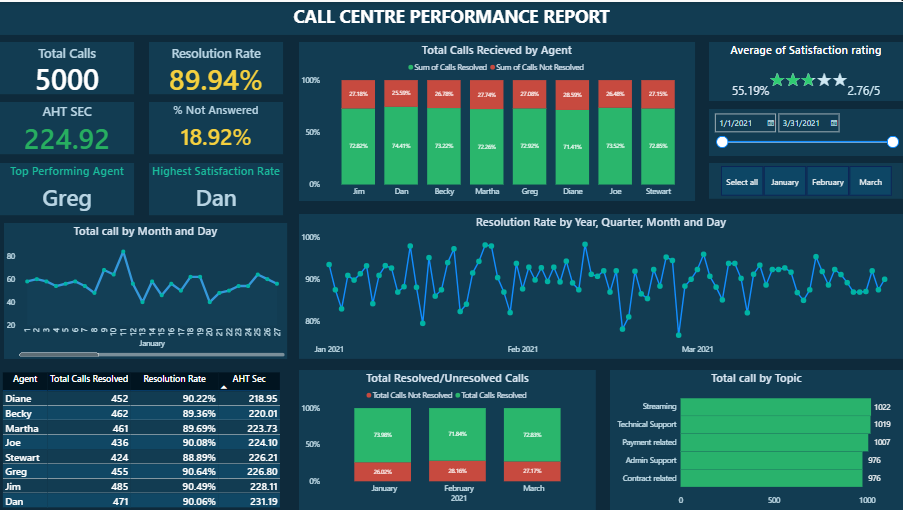

# 📊 Call Centre Performance Report – Power BI Dashboard

## 📌 Project Overview

This project showcases an interactive **Call Centre Performance Dashboard** built using Power BI.  
It provides a comprehensive view of operational efficiency, agent performance, call trends, and customer satisfaction metrics.

The dashboard is designed to help stakeholders monitor KPIs, identify performance gaps, and support data-driven decision-making.

---

## 🎯 Business Objective

The primary objectives of this dashboard are:

- Monitor overall call centre performance
- Track agent-level efficiency
- Analyze resolution trends over time
- Identify missed call patterns
- Evaluate customer satisfaction levels
- Improve operational efficiency and service quality

---

## 📈 Key Performance Indicators (KPIs)

The dashboard tracks the following metrics:

- **Total Calls**
- **Resolution Rate (%)**
- **Average Handle Time (AHT - Seconds)**
- **% Not Answered**
- **Top Performing Agent**
- **Highest Satisfaction Rate**
- **Customer Satisfaction Rating (Out of 5)**

All KPI cards use **rule-based conditional formatting (Red–Amber–Green logic)** aligned with defined business thresholds.

---

## 📊 Dashboard Features

### 1️⃣ Agent Performance Analysis
- Total calls resolved by agent
- Resolution percentage by agent
- Agent-level AHT comparison
- Identification of top performers

### 2️⃣ Trend Analysis
- Resolution rate by Year / Quarter / Month / Day
- Daily call volume trends
- Monthly resolved vs unresolved comparison

### 3️⃣ Topic-Based Analysis
Call distribution by issue type:
- Streaming
- Technical Support
- Payment Related
- Admin Support
- Contract Related

### 4️⃣ Interactive Filters
- Date range slicer
- Month selection
- Dynamic KPI updates

---

## 🧠 Business Insights

This dashboard helps answer:

- Which agents consistently perform well?
- Is the resolution rate improving over time?
- Are missed calls increasing?
- Is AHT within acceptable benchmarks?
- Which topics generate the highest call volume?
- How does customer satisfaction relate to resolution performance?

---

## 🎨 Design Approach

- Executive-style dark theme
- Rule-based KPI threshold framework
- Clean layout with clear visual hierarchy
- Business-focused and interview-ready presentation

---

## 🛠 Tools & Technologies Used

- Power BI Desktop
- DAX (Measures & KPI calculations)
- Data Modeling (Fact & Dimension structure)
- Rule-Based Conditional Formatting
- Interactive Slicers

---

## 📂 Data Notes

- Missed calls are excluded from performance KPI calculations for accuracy.
- AHT and Resolution metrics are benchmark-based using defined thresholds.

---

### 🧭 Performance Overview

---

## 🔗 Live Dashboard

[View Live Dashboard](https://app.powerbi.com/view?r=eyJrIjoiZjEzMmFlMzMtNjE1ZC00YmI2LTlmNmQtY2UwZDUzZmMxODI1IiwidCI6IjNiY2YzZjA3LWFkMDAtNDlkMC1iOTNiLWI3ZWQ0MDA1MzI3NyJ9)

---
